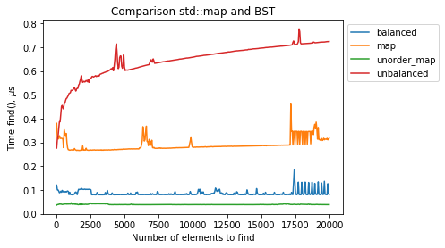
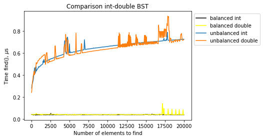

#Binary Search Tree
##Introduction
The exercise consists in implementing a templated Binary Search Tree in the C++ programming language.
The BST is a hierarchical data structure where it is possible to fastly store, remove and lookup data.

Our implemented tree is a rooted binary tree whose nodes store a pair made of a key and a value. An order relation is also required, so that keys can be compared. Indeed the nodes can have at most two children, namely left and right, and the rule is that the key in the left child is always smaller than the parent's key, while the right is always bigger. The tree is not autobalancing, however we implemented a method able to balance the tree.

After implementing the binary search tree, we benchmarked it, comparing the performance of both the balanced and unbalanced version against the standard library classes map and unordered\_map.

##Structure of the Code

The code is composed by three classes:

* `BST<Tk,Tv,Tc>` which implements the templated Binary Search Tree itself. This class is templated in the key type `Tk`, the value type `Tv` and a comparison operator `Tc` used to compare the keys. The default value for the comparison operator is `std::less<Tk>`. Members of this class are `root` (a `std::unique_ptr` pointing to the root node of the tree) and a functional object `comp` used to store the value for the third template.

* `node<N>`is a templated class whose members are `data` (storing the data contained in the node, of type `N`) and three pointers: `left` and `right` (`std::unique_ptr` pointing to the left and right child node respectively), and `parent` (raw pointer pointing to the parent node). Although it
seemed reasonable to have this class as a nested class of `BST`, we preferred to implement it separately, since it does not rely on the third template `Tc`. Nevertheless, inside the class `BST`, we use as template `N` of the Node an `std::pair<const Tk, Tv>` (the key type `Tk` is set as `const` to improve the consistency of the operations, indeed if a key is already present in a node of the tree, it cannot be changed).

* `iterator<N, I>` is a templated class whose members is `current`, a raw pointer to the current node of type `N`. The second template argument `I` is needed to distinguish between constant and non constant iterators. This class is used to traverse the `BST`. As previously said for the class `Node`, we decided to not implement this as a nested class of `BST`, even if it seemed suitable, because it is templated on different types.

##Member Functions

####Member functions of the class `node`
In the class `node` we implemented the recursive function `findSmallest` which returns a pointer to the node having the smallest key among all the nodes in the tree having the current node as root, and the recursive function `findBigger`, which returns the node with the smallest key among all the nodes having the key bigger than the one of the current node (namely the inorder successor of a node which is right child of its parent).

####Member functions of the class `iterator`

In the class `iterator` we overloaded the operators `*` (which returns the data contained in the node pointed to by the iterator), `->` and `++` (with usual meaning) and a function `node`, which returns a pointer to the node pointed to by the iterator.

####Copy semantics
```
//private
void copy(const std::unique_ptr<Node>& n);

//public
BST(const BST& tree);
BST& operator=(const BST& tree);
```
Copy semantics is implemented as a copy constructor and the overload of the operator ``=``. It is used to make a deep copy of a binary search tree, with the help of the private function `copy`, which recursively copies all the subtrees of a binary search tree given its root.

####Move semantics
```
//public
BST(BST&& tree);
BST& operator=(BST&& tree);
```
Move semantics is implemented as a move constructor and the overload of the operator ``=``. It is used to move the elements of a binary search tree into another tree, without copying them.

####Begin
```
//public
Iterator begin() noexcept;
Const_iterator begin() const noexcept;
Const_iterator cbegin() const noexcept;
```
`Begin` is used to start iterations on the tree. It returns an iterator to the leftmost node, the one with the smallest key. These functions call  `findSmallest` function defined in the struct `node`.  

####End
```
//public
Iterator end() noexcept;
Const_iterator end() const noexcept;
Const_iterator cend() const noexcept;
```
`End` is used to finish an iteration on the tree, it returns an iterator pointing to one past the last element of the tree.

####Insert
```
//private
template<class T>
std::pair<Iterator, bool> insertPrivate(T&& x);

//public
std::pair<Iterator, bool> insert(const pair& x);
std::pair<Iterator, bool> insert(pair&& x);
```
The insert functions are used when the user wants to insert a new node inside the BST. Both the public functions call `insertPrivate`, a function defined in the private part of the class. This function uses as argument a pair composed by a key of our new node and a value which will be stored inside the node. The pair is passed to the constructor using `std::forward`, so that we avoid code duplication. In fact the `std::forward` passes the variable as lvalue if we use the first `insert` function, and passes it as rvalue if we use the latter one. If the BST is empty this function inserts the first node that will be the root of our tree. If we already have a BST, the function will insert the node in the right place by making the comparison we have chosen between the keys (in our case we use the operator `std::less<Tk>`). These functions return a pair made up by an iterator that points to the new node inserted and a boolean value, which is false if the node with the key we want to insert has already been inserted, true otherwise.

####Emplace
```
//public
template<typename... Types>
std::pair<Iterator, bool> emplace(Types&&... args);
```

The `emplace` function is used when the user wants to insert a new element into the container constructed in-place with the given args, if there is no element with the key in the container. It uses a variadic template so that the user can simply pass two values to this function. It returns a pair composed by an iterator that points to the inserted node, or to the node with that key, and a boolean value, which is false if the node with the key we want to insert has already been inserted, true otherwise.

####Find
```
//private
Iterator findnode(const Tk& x) const;
//public
Iterator find(const Tk& x);
Const_iterator find(const Tk& x) const;
```
The `find` functions are used when the user wants to find a node in the BST with a given key. Both functions call `findnode`, which is a private function that finds the node with the input Key if it exists, the nearest one (meaning the one in which a node with that key should be inserted) otherwise, or `nullptr` if the tree is empty. The first returns an iterator which points to the node that have the given key, the latter returns a const iterator which also points to the given key. If that key is not found both function will return a null iterator (const null iterator in the second case). If the tree is empty they return `end()` or `cend()` respectively.

####Subscripting operator
```
//public
Tv& operator[] (const Tk& k);
Tv& operator[] (Tk&& k);
```

This operator searches for the key it is given in input. If such key is present in the tree, it returns the value correspondent to that key, if it is not, it inserts the pair made by the given key and a default constructed value. In order to do this it relies on the function `insert`.
This operator has been overloaded twice, according to what has been done with the function `insert`: in the first case an lvalue is passed to the function, in the second the argument is an rvalue.

####Balance
```
//private
std::vector<pair> BalancePrivate();
void rebuildtree (std::vector<pair>>& values, int start, int end);
//public
void Balance();
```
The function `BalancePrivate` is used to save all the pairs key-values contained in the nodes of the tree in a vector, before the tree is destroyed.

The function `rebuildtree` is a recursive function used to build a new tree that is perfectly balanced. In particular this function takes as argument a vector that contains all the values and the keys stored in the tree in increasing order (as a result of `BalancePrivate`). At every recursive step the median value of this vector is computed and inserted it in the new tree (with the function `insert`), and the function is recursively called on the two halves of the vector.

The function `Balance` calls the two previously described functions, in order to store the key-value pairs contained in the tree in a sorted vector, delete the old tree using the function `clear`, and reconstruct it.

####Put-to operator
```
#ifdef PRINT
//private
void printNode(const std::unique_ptr<Node>& n, std::ostream& os) const;
void printBST(const std::string& prefix, const std::unique_ptr<Node>& n, bool nleft, std::ostream& os) const;
//public
std::ostream& printTree(std::ostream& os) const;
#else
//public
std::ostream& printOrderedList(std::ostream& os) const;
#endif

friend std::ostream& operator<<(std::ostream& os, const BST& tree);
```
If `PRINT` is defined at compile time, the operator `<<` is overloaded by the function `printTree`, that prints the structure of the tree in a graphic way, this tool is helpful to visualize the relations among the nodes composing the tree. In particular the function `printBST` is a recursive function which establish how this structure should be printed, inserting indentation where necessary, and calling the function `printNode`, which simply prints the data contained in the input node.

if `PRINT` is not defined at compile time, than the operator `<<` is overloaded by the function `printOrderedList`, which prints the tree in a sequential way. We use it to easily print a tree type object.

The operator `<<` is declared `friend` because it needs access to all private variables of the BST class.

####PrintChildren
```
//public
void PrintChildren(Tk a);
```
This function, given a key as input, prints on the screen the input key and key of the right and left child of the node containing that key. It is useful for checking the relations that exist in a node, for example before and after the deletion of a node.

####Erase
```
//private
void RemoveRootMach();
void RemoveMatch(Node* parent, Node* match, bool left);
//public
void erase(const Tk& k);
```

The function `RemoveRootMach` is used to delete the `root` node of a binary search tree. It behaves differently according to the following cases:

 0. `root` has no children: the tree consists of the root only. In this case we reset the `root`.
 1. `root` has one child:
    * right child: the new root should be the right child of the current root. To do this, we firstly delete the connections that exist between the root (to be deleted) and the right child (to retrieve it easily, we create a temporary pointer pointing to it). After that we delete the root, thus obtaining the root pointer pointing to `nullptr`. As last step, the root pointer is pointed at the right child thus making it the new root.
    * left child: the new root should be the left child of the current root. Analogous to the previous case.
  2. `root` has both children: the new root should be the inorder successor of the current root, namely the node with the smallest key in the right subtree.  Once the node with the smallest key in the right subtree has been found, it has to be isolated by eliminating all the connections it has with its parent node and make it point by a temporary pointer. Children of the node just found will be attached to the parent of the found node. After that, the two children of the root detach and connect to the temporary node. At this point the `root` pointer can be resetted to the chosen node, in such a way that the tree with the new root respects all the constraints of a BST.

The function `RemoveMatch` is used to remove an internal node. As before, we need to distinguish three cases:

1. The node has no children: it is a leaf node and we can delete it easily.

2. The node has one child: we need to replace the node with its child. The technique used is analogous to the one used to delete the `root`.

3. The node has both children: it has to be replaced by its inorder sucessor. Here again the technique used is the one described for the `root` node.

The function `erase` is called when the user wants to cancel a node. It takes as input the key of the node we want to delete. If there isn't any node with that key in the tree or the tree is empty, a warning message is printed on the screen. Otherwise the node is found (by means of the function `find`) and, if it turns out to be the `root`, the helper function `RemoveRootMach` is called, if it is an internal node, the function `RemoveMatch` is called with proper arguments.

####Clear
```
//public
void clear();
```
This function deletes the tree by resetting the `root`.

##Benchmark

In order to test our Binary Search Tree, we compared its performance, in both the balance and unbalanced version, against the one of the Standard Library map and unordered\_map, with integer key. Because of the implementation of the map and the unordered\_map in STL, we expect that the time to find an element among N for the map is logarithmic, $O(log_{2}{N})$, and for the unordered\_map is constant, O(1). For our balanced Binary Search Tree, we expect at most $O(log_{2}{N})$ and for the unbalanced version at most O(N) in the worst case (a "linked list" binary tree, in which elements are inserted all either in increasing or decreasing order) in order to find an element among N. In the following graph are shown our result, obtained running the code `benchmark.cc`, compiled with -O3 optimization, averaging the five measurement we obtain out of that code.  



The results are consistent with our expectation: the unordered\_map is the fastest container, followed by the balanced tree, the map and the unbalanced tree.

Furthermore we compared the Binary Search Tree with integer keys, with the one with double-typed keys. We expected that the BST with integer keys had a better performance than the double-typed keys, since the comparison between integers is easier to be performed.



The results partially disagree with our expectations, indeed the performance of the two (the balanced and the unbalanced version respectively) are comparable in almost all points, while we expected the integer-typed BST to be much more efficient than the double-typed one.
